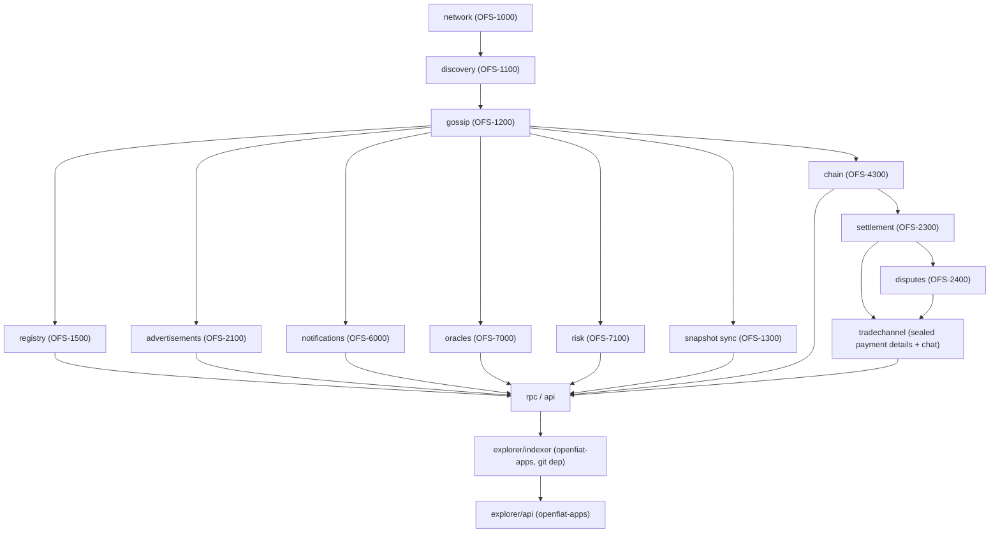

# Architecture — openfiat-core

## Dependency chain

Crates below `gossip` cannot be meaningfully tested until `gossip` exists — the
provider crates (registry, advertisements, notifications, oracles, risk,
snapshot) all depend on it for event propagation, so the crate build order
and the phased implementation plan both follow this chain:



`tradechannel` sits below both because it holds no state of its own that
either does not already establish: a settlement says who may write to a
channel, and a dispute says who may be granted the key to read one. It
carries ciphertext and never a key — see `trade-channel.md` for what a
node operator and an arbitrator can each actually see, and for why
presence and typing indicators are deliberately not in the event log.

Shared foundational crates (`types`, `serialization`, `crypto`,
`storage`/`database`) sit underneath `network` and are depended on by
everything above.

`chain` (OFS-4300) is the bridge to the Solana execution layer OFS-4200's
on-chain programs run on — it rides on `gossip` for blockhash announcement
and transaction relay between RPC-connected and gossip-only nodes, and is
`settlement`'s path to actually submitting the escrow-release instruction,
closing the gap that crate's own doc comments flag as pending.

## Canonical `Priority` enum

OFS-1000 §21, OFS-1200 §14, and OFS-1600 §10 each list network priority
tiers, and the three lists are not byte-identical. OFS-1600 §10 ("Priority
Classes") is adopted as canonical — it is the most granular of the three and
is the one the Stake-Weighted QoS mechanism actually operates over. The
other two specs' lists are treated as compatible high-level summaries of
this ordering, not independent orderings to reconcile against.

```rust
/// Canonical per OFS-1600 §10. Lower numeric value = higher priority.
#[repr(u8)]
enum Priority {
    SessionReservationSettlement = 1, // Session Control, Reservation, Settlement
    TradeEscrow = 2,                  // Trade Updates, Escrow Events
    Advertisement = 3,                // Advertisement Updates
    Reputation = 4,                   // Reputation
    Governance = 5,                   // Governance
    Snapshot = 6,                     // Snapshots
    BackgroundSync = 7,               // Background Synchronization
}
```

SWQoS (stake-weighted ordering) applies *within* each class, not across
classes — a class-1 message from a low-stake node still outranks a class-2
message from a high-stake node.

## Numeric protocol parameters

The specs listed below explicitly leave these values to the implementation
(OFNP §18: *"Heartbeat intervals are implementation-configurable"*; OGP §12's
`TTL = 8` is given only as an illustrative example, not a mandated default;
SRP, ONP, and OOP name the mechanisms but not the numbers). Each default
below is `[PROPOSED — NEEDS SIGN-OFF]`, the same pattern OFS-4100 used for
tokenomics numbers — implementation defaults, not spec violations.

| Parameter | Default | Spec hook | Rationale |
|---|---|---|---|
| Session heartbeat interval | `15s` | OFNP §18 | Frequent enough to catch a dead peer well inside a 30-min reservation timeout window, cheap enough not to matter at scale. |
| Heartbeat timeout (session termination) | `45s` (3 missed heartbeats) | OFNP §18, §22 | Tolerates one lost packet without flapping; three strikes avoids a single dropped heartbeat killing an otherwise-healthy session. |
| Gossip TTL (default hop budget) | `8` | OGP §12 | Matches the spec's own illustrative example; revisit once real cluster diameter is measured. |
| Gossip dedup/replay-protection retention | `24h` | OGP §10–11 | Covers the longest-lived trade lifecycle (reservation → settlement → dispute window) with margin; bounded so the RocksDB dedup store doesn't grow unbounded. |
| Service Registry health-update interval | `30s` | SRP §11 | Matches other liveness signals in this table; cheap for a registered service to sustain continuously. |
| Service Registry auto-expiration threshold | `90s` (3 missed health updates) | SRP §18 | Same 3-strikes tolerance as session heartbeats, scaled to the health-update interval. |
| Notification delivery retry backoff | `1s, 5s, 30s, 5m`, then give up (4 attempts) | ONP §13–14 | Exponential backoff covering both transient network blips and a longer-lived provider outage, without retrying forever against a dead channel. |
| Oracle default update frequency | `30s` | OOP §8 | Balances price freshness against gossip volume; providers MAY publish more often per their own registered metadata (SRP §9). |
| Oracle record staleness threshold | `90s` (3 missed updates) | OOP §11 | A record older than this is excluded from median aggregation rather than treated as a live quote. |

## Storage

RocksDB (`crates/database`, wrapping `crates/storage`'s trait abstraction)
is the single storage engine for everything above it that needs
persistence: the gossip event/dedup store, the Service Registry, snapshot
import/export, and risk-intelligence indexing.

## Wire format

`serde` + `postcard` for internal Rust↔Rust messages inside the gossip
envelope (compact, `no_std`-friendly, no cross-language requirement exists
yet — `bincode` was evaluated and rejected: its own maintainers have marked
it unmaintained/deprecated with no safe upgrade path). JSON remains at the
HTTP/RPC boundary (`crates/rpc`, `crates/api`, `explorer/api`) where
human/cross-language readability matters more than size.

## Transport

libp2p (OFS-1000 §4): Noise for authenticated encryption, QUIC as the
primary transport, Yamux as the stream multiplexer. TCP is kept as a
fallback transport; the `dns` feature is intentionally omitted for now
(see Decision Log item 3a in the implementation plan) — bootstrap peers are
addressed by multiaddr/PeerId, not hostname, until DNS resolution is
revisited.
